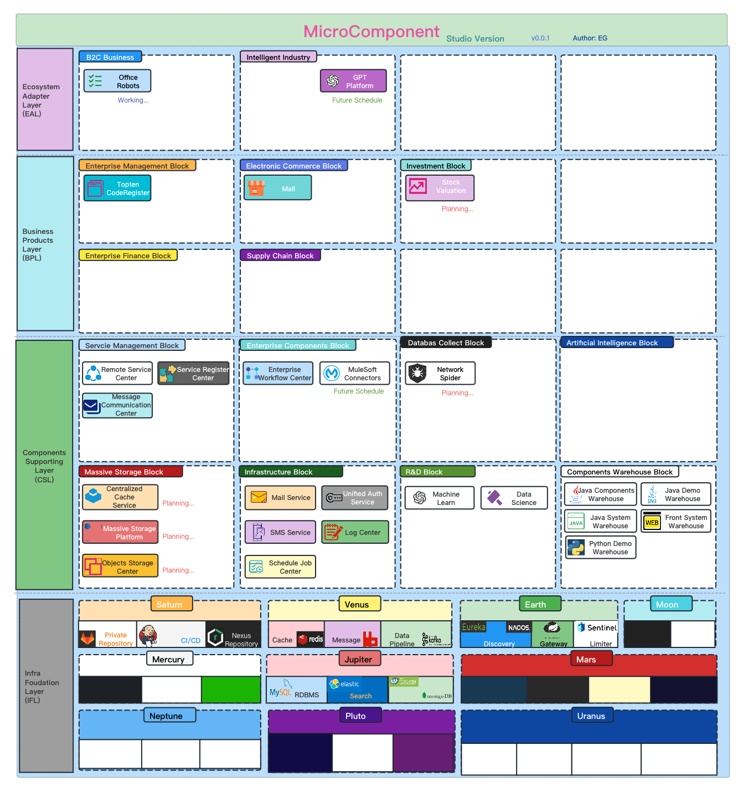
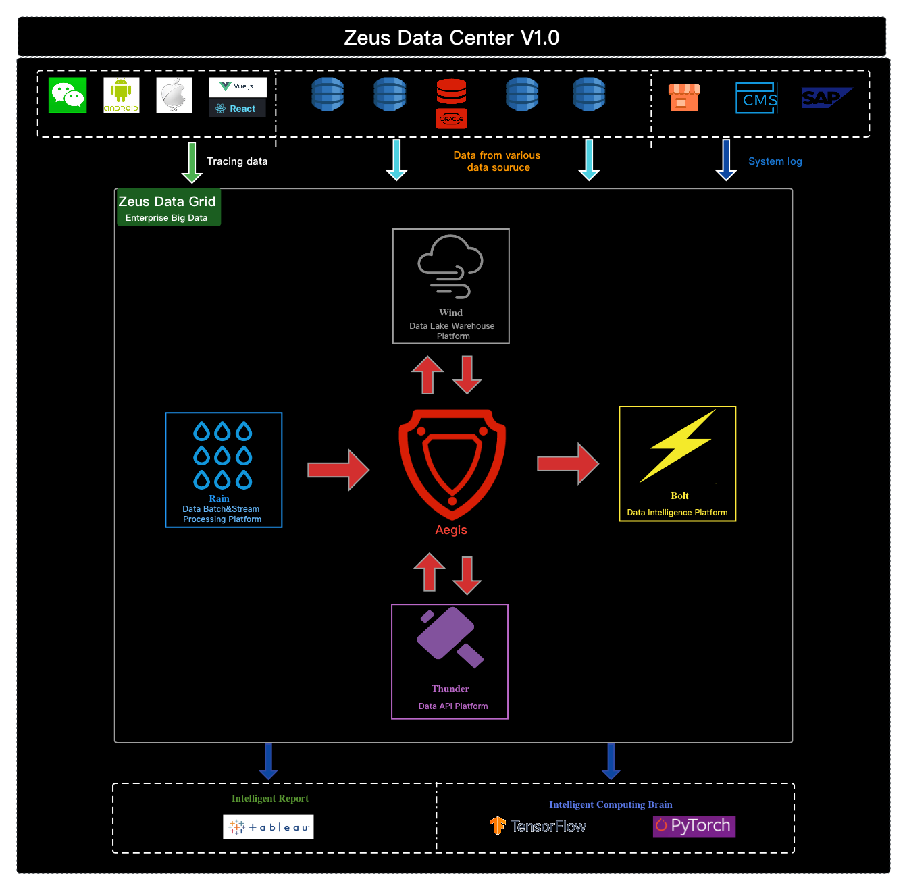

### 1. General Architecture Layers

- Ecosystem Adapter Layer(EAL)
  It is the outlet of the whole micro-component ecosystem. It contains various front end projects which connect the ecosystems both internal and outside.

- Business Products Layer(BPL)
  It is the layer which contains various products of micro-component.

- Components Supporting Layer(CSL)
  It is the layer which contains various components or generic microservices centers of micro-component.

- Infrastructure Foudation Layer(IFL)
  It is the foundation of micro-component just like the base of the house.

##### Each layer of architecture contains several blocks.
##### Blocks are logical combinations of products belong to the layer.

- Nomenclatures

| Name     | Description                                          |
| -------- | ---------------------------------------------------- |
| Service  | Small scale logically combined microservices units. Containing just server side code.  |
| Center   | Middle scale logically combined microservices units. Containing both server side and front end code. |
| Platform | Large scale logically combined microservices units. Containing several server side and front end code.  |
| Warehouse | A bunch of code gathering together for developers to pick. |

#### Platform > Center > Service
#### Warehouse = Code Templates

&nbsp;

### 2. Main catalogs of blocks in four layers
#### 2-1. Ecosystem Adapter Layer(EAL)

| Block Name | Catalog Link         |
| -------- | -----------------------|
| B2C Business | [Catalog](EAL/Block1/Catalog.md) |
| Intelligent Industry | [Catalog](EAL/Block2/Catalog.md) |

#### 2-2. Business Products Layer(BPL)

| Block Name | Catalog Link         |
| -------- | -----------------------|
| Enterprise Management Block | [Catalog](BPL/Block1/Catalog.md) |
| Electronic Commerce Block | [Catalog](BPL/Block2/Catalog.md) |
| Investment Block | [Catalog](BPL/Block3/Catalog.md) |

#### 2-3. Components Supporting Layer(CSL)

| Block Name | Catalog Link         |
| -------- | -----------------------|
| Service Management Block | [Catalog](CSL/Block1/Catalog.md) |
| Enterprise Components Block | [Catalog](CSL/Block2/Catalog.md) |
| Security Block | [Catalog](CSL/Block3/Catalog.md) |
| Artificial Intelligence Block | [Catalog](CSL/Block4/Catalog.md) |
| Massive Storage Block | [Catalog](CSL/Block5/Catalog.md) |
| Infrastructure Block | [Catalog](CSL/Block6/Catalog.md) |
| Application Diagnostic Block | [Catalog](CSL/Block7/Catalog.md) |
| Components Warehouse Block | [Catalog](CSL/Block8/README.md) |

&nbsp;

### 3. A Bird View Blue Print of MicroComponent V2

&nbsp;

### 4. Zeus Data Center

- Aegis Data Warehouse
- Wind
- Rain
- Thunder
- Bolt

